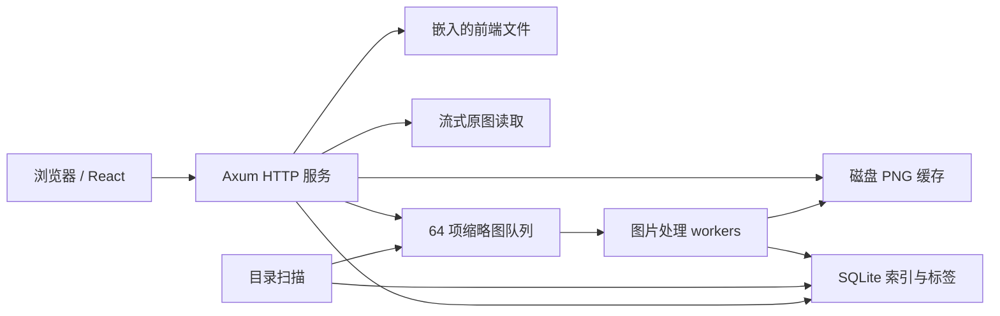

# Picsoc 架构说明

本文描述当前实现，供修改代码时核对行为。接口参数见 [API](API.md)，部署和备份见 [运维说明](OPERATIONS.md)。

## 运行结构

Picsoc 是一个 Rust 服务进程：Axum 同时提供 HTTP API、原图和嵌入的网页；React 前端由 Vite 构建为 `frontend/dist`，再通过 `rust-embed` 编入程序。Cargo 的 `build.rs` 在网页缺失或输入变化时自动调用 npm 构建，未变化时复用结果；Docker/发行构建用 `PICSOC_FRONTEND_PREBUILT=1` 使用已构建网页。正式运行不需要 Node.js 或第二个前端端口。启动入口及 CLI 配置在 [main.rs](../src/main.rs)，路由和中间件在 [api.rs](../src/api.rs)。

HTTP 默认监听 `127.0.0.1:3210`，`--bind` 可调整。启动日志区分监听地址、本机网页及网络访问地址；IPv4 全地址绑定使用 [network.rs](../src/network.rs) 枚举活跃网卡，不访问外部服务。默认数据目录位于当前用户的应用数据目录；数据库为 `picsoc.sqlite3`，缩略图位于 `thumbnails`。素材库保留原有目录结构，索引、收藏、标签和缓存写入数据目录，原图只读访问。

前端使用虚拟网格和分页，每页 100 条素材，LRU 缓存目标为 8 页，当前可见页受保护，见 [useAssets.ts](../frontend/src/useAssets.ts)。API 单页上限为 200 条，排序带 `id` 作为稳定的次级键。

## 数据模型与并发

数据库定义及查询集中在 [db.rs](../src/db.rs)，对外模型在 [models.rs](../src/models.rs)。数据库开启 WAL、`synchronous=NORMAL`、外键和 5 秒 busy timeout，当前 schema 的 `user_version` 为 2。旧版本新增 `assets.parent_folder`，每批读取 500 条素材路径回填直接父目录和所有祖先目录，迁移在事务中完成，原素材 ID、收藏和标签保留。

| 表 | 主要内容 | 约束与索引 |
| --- | --- | --- |
| `libraries` | 名称、规范化后的绝对目录路径 | `path` 唯一 |
| `assets` | 库 ID、相对路径、直接父目录、文件名、格式、大小、尺寸、秒/纳秒修改时间、收藏、扫描代次、缩略图错误 | `(library_id, relative_path)` 唯一；修改时间、库内修改时间、收藏、直接父目录、尺寸和大小索引 |
| `library_folders` | 库 ID、相对目录、直接父目录、名称、扫描代次，包括空目录 | `(library_id, relative_path)` 主键；`(library_id,parent,relative_path)` 索引 |
| `asset_tags` | 素材 ID、标签 | `(asset_id, tag)` 主键；`(tag, asset_id)` 索引 |

库删除级联删除目录、素材和标签。素材身份目前由“库 ID＋相对路径”确定：内容更新复用原 ID、标签和收藏；外部重命名或移动文件会产生新记录，成功扫描后删除旧记录，标注不会自动迁移。

当前共享一个 `rusqlite::Connection`，通过 `Arc<Mutex<_>>` 串行访问。HTTP 数据库调用和扫描、图片解码使用 `spawn_blocking`；WAL 并不意味着当前连接可以同时执行多个查询。需要扩大数据库并发时，应先测量锁等待，再评估连接池或独立写入任务。

批量操作最多处理 500 个去重 ID，收藏与标签修改处于同一事务；任一素材不存在或最终标签超过 50 个，整批回滚。标签先删除后添加，因此交集中的标签最终保留。

## 扫描、取消与缩略图

[scanner.rs](../src/scanner.rs) 在启动时扫描已有素材库，之后默认每 300 秒扫描；`--scan-interval 0` 关闭周期扫描。手动扫描使用同一流程。当前“增量”是复用未变化的元数据和缩略图，每次扫描仍遍历目录，没有文件系统实时监控。

1. 全局 semaphore 限制同时只有一个目录扫描。扫描状态保存在内存中，重启后重新建立。
2. `WalkDir` 不跟随符号链接，最多打开 8 个目录句柄，并跳过 Picsoc 自己的数据目录及 Apple Photos `.photoslibrary` 包目录。对本轮实际遇到的图库包，以精确相对路径范围标记旧记录仍被保留；不读取包内内容、不删除其旧注释，普通目录的缺失文件仍正常清理。图库包及包内目录不能直接添加为素材库。
3. 分批提交文件和真实目录索引，包含没有图片的目录。每次扫描具有独立 `seen_generation`，修改时间或大小变化时清除尺寸与缩略图错误，并删除旧缓存。
4. 未缓存、未记录失败的素材进入容量 64 的队列。默认 1 个图片 worker，`--workers` 可设为 1–4；队列满时扫描等待空位。
5. 遍历完整成功后，每批最多删除 200 个未被本轮扫描发现的旧素材或目录记录，并清理素材缓存。目录枚举或文件 metadata 查询失败时保留旧索引并报告错误。

取消扫描设置取消标记，在遍历和批次边界检查；已提交的批次保留，尚未完成的遍历不会触发缺失文件清理。已经进入队列或正在解码的缩略图任务可以继续。正常完成时 `scan.state=idle` 表示遍历与入队完成，缩略图仍可能在后台处理；尺寸在图片处理结束后写入。

[media.rs](../src/media.rs) 使用纯 Rust `image` 库处理 JPEG、PNG、GIF、WebP、BMP、TIFF。缩略图最长边不超过 384 像素，小图保持原尺寸，使用保留透明通道的 PNG；GIF 取首帧，JPEG 等格式应用 decoder 提供的方向信息。成功的旧缓存继续复用，避免升级时强制重解码整库。原图访问保留 GIF 动画。

单文件超过 256 MiB、解码像素缓冲超过 128 MiB或任一尺寸超过 32768 时跳过缩略图。解码器也设置分配限制。这些是处理阈值，进程总内存还包含解码器临时分配、方向变换、HTTP 请求和数据库，不构成固定 RSS 或绝无内存泄漏的保证。

失败原因写入 `thumbnail_error`，HTTP 返回无文字 SVG 占位图；原图读取不依赖缩略图成功。周期扫描保留未变化素材的失败状态，避免持续重复解码坏图；手动扫描会清除失败状态并重试。

## 缓存和原图读取

缓存路径为 `thumbnails/<library_id>/<id>-<mtime_ns>-<size>.png`。生成时写入带进程号与序号的唯一临时文件，再重命名到目标路径；完成后再次检查数据库中的素材版本，清理已删除或已变更任务的结果。

`thumbnail_url` 还带 `pending`、`error`、`ready` 状态版本：失败恢复或生成成功时 URL 改变，浏览器会重新加载。成功缩略图允许私有缓存 24 小时，SVG 占位不缓存。原图 ETag 使用素材版本，响应要求重新验证。当前变化检测依赖修改时间与大小，没有对原图内容计算哈希。

原图只通过索引 ID 获取文件路径，不接受任意文件路径参数。`secure_path` 拒绝绝对路径、`..` 等非普通相对组件，检查素材根目录仍对应原规范路径，并规范化目标路径、确认其位于库内且为文件。读取采用 `ReaderStream` 和 64 KiB 块，支持单段 Range、ETag 和条件请求，不把整个原图载入内存，见 [api.rs](../src/api.rs)。

所有路由经过统一中间件，检查请求的 Origin；回环绑定还限制 Host 为 localhost 或回环地址。设置 `PICSOC_PASSWORD` 后，静态前端和认证接口允许匿名访问，数据 API 和媒体通过会话 Cookie 或兼容的 Basic Auth 认证。中英文错误按每个请求的 `Accept-Language` 处理，保留兼容的 `error` 并提供稳定 `code`，见 [i18n.rs](../src/i18n.rs)。

[auth.rs](../src/auth.rs) 管理有界内存会话，操作系统随机令牌不包含密码，24 小时后过期，退出撤销，服务重启失效。前端 [AuthGate.tsx](../frontend/src/AuthGate.tsx) 先读取认证状态，登录后才挂载素材界面；数据请求返回 401 时回到登录页。密码仅在登录表单内存中短暂保留，不写入浏览器持久存储。语言切换由 [LanguageMenu.tsx](../frontend/src/LanguageMenu.tsx) 提供统一菜单样式。

## 路径、文件夹与搜索

库的绝对路径使用当前操作系统的 `canonicalize` 结果。Windows 可能返回 `\\?\C:\...` 的扩展路径，调用者应原样传回，不用文本差异判断目录身份。相对素材路径也保持平台格式：Windows 通常用反斜杠，Unix 用斜杠；Unix 文件名中的反斜杠是普通字符。

[folders.rs](../src/folders.rs) 仅接受相对目录的普通组件，将平台允许的分隔符统一为主分隔符。目录 API 从 `library_folders` 按 parent 索引懒加载，空目录也返回，不在 HTTP 请求中遍历原图目录。每页最多返回 1000 个直属子文件夹（前端每页 200），超出时返回 `truncated=true` 与 `next_cursor`，用相对路径进行 keyset 分页；每项通过索引查询直接素材数量、递归素材数量及是否有子目录，并返回平台 `separator`。

递归目录筛选利用 `(library_id, relative_path)` 索引和大小写敏感的 BINARY 前缀范围，仅当前目录的筛选使用 `parent_folder` 精确匹配。名称中的空格、点号、`%` 和 `_` 不参与通配匹配。前端 [LibraryTree.tsx](../frontend/src/LibraryTree.tsx) 独立处理目录展开与选择，缓存已加载层级；刷新后用新响应恢复可见分支的分页深度，避免丢失“加载更多”进度。

方向、宽高比、宽高及文件字节范围在 SQL 中组合过滤，计数与分页使用同一 WHERE 条件。比例允许 ±2% 相对误差；未知尺寸不会匹配方向、比例或像素范围。查询模型先验证枚举、正数比例和范围，非法输入返回 400。前端 [FilterPanel.tsx](../frontend/src/FilterPanel.tsx) 校验后应用条件，并将 MB 转换为 API 字节数。

`exclude_names` 按换行拆分、去空和去重，最多 50 项，仅对 `assets.name` 添加字面子串的 `NOT LIKE` 条件；不会把目录名或标签当作噪音文件名。关键词中的通配符被转义，排除词与其他筛选共用分页计数条件。

搜索使用 SQLite `LIKE` 对文件名、相对路径和标签做子串匹配，转义输入中的 `%`、`_` 和反斜杠。中文可直接包含匹配；ASCII 默认不区分大小写，没有中文分词、拼音、Unicode 大小写折叠或相关性排序。前导 `%` 搜索通常不能直接使用 B-tree 索引缩小候选集，大规模搜索应通过实际数据评估，再决定是否引入 FTS 或专门检索索引。

## 扩展与验证入口

- 新图片格式及其他缩略图引擎：从 `media.rs` 的格式识别、解码和缓存生成入口扩展，保留队列并发与失败恢复约束。
- 文件实时监控：向扫描器提交增量工作，并保留完整扫描用于校正遗漏；不要只依赖监控事件清理索引。
- 文件移动后保留标注、内容去重：需要新增稳定身份或内容指纹，并设计 schema 迁移；当前没有这些机制。
- 搜索或数据库优化：先定位 SQL、锁等待与磁盘处理成本，验证后调整索引或存储方式。

Rust 测试分布在各模块，覆盖事务回滚、路径边界、目录计数、扫描与缓存；HTTP 端到端验证见 [api_smoke.py](../tests/api_smoke.py)，测量工具见 [benchmark.py](../scripts/benchmark.py)。修改 API 后应同时检查前端类型、[接口文档](API.md) 和端到端测试。
